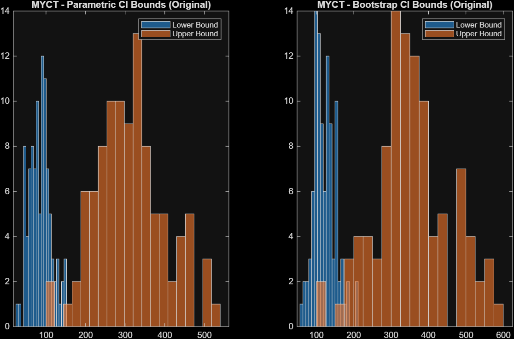
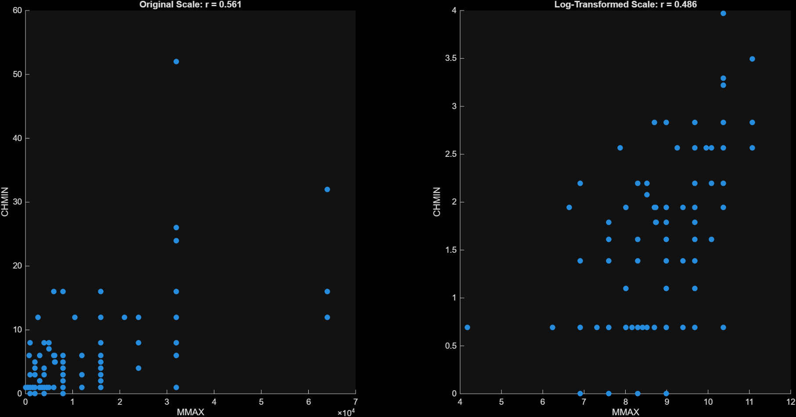
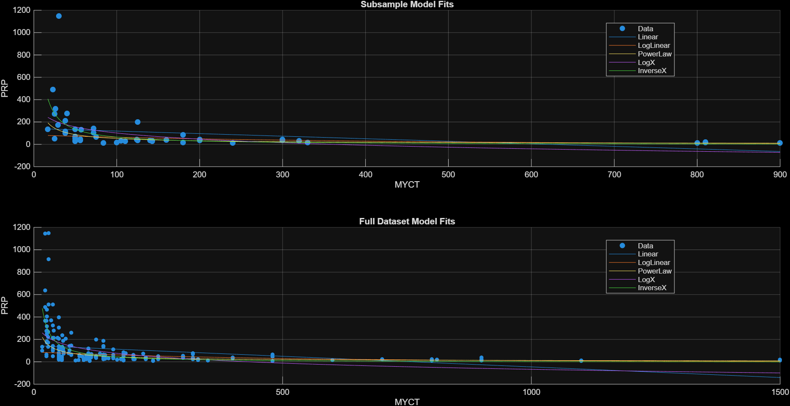
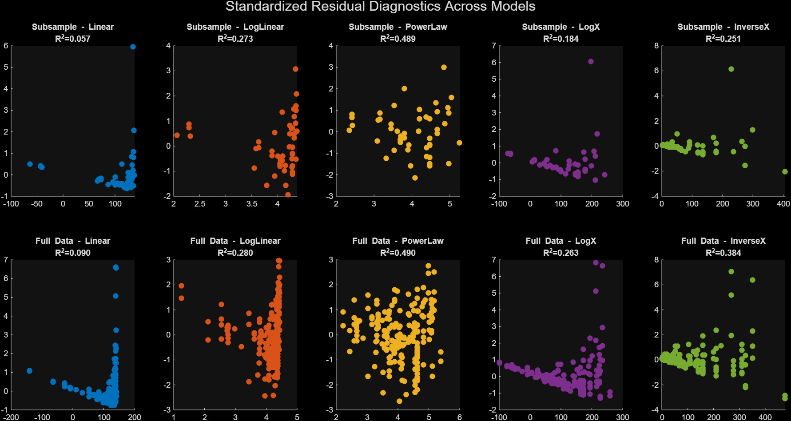

# CPU Performance Analysis: Statistical Inference and Predictive Modeling

## Project Overview

This project presents an applied data analysis study focused on understanding, modeling, and interpreting CPU performance using statistical inference and regression techniques. The analysis is based on a classic real-world dataset describing computer processor characteristics and their observed performance.

Rather than treating the dataset as a purely predictive benchmark, the project emphasizes **statistical reasoning**, **sampling variability**, **model diagnostics**, and **methodological decision-making**. Through a sequence of focused analytical investigations, the project explores how conclusions about performance, relationships between variables, and model reliability depend on assumptions, sample size, and analytical choices.

The work is structured around **five core analytical questions**, each motivated by a realistic data science scenario and designed to demonstrate meaningful understanding of data analysis beyond mechanical computation.

---

<table>
  <tr>
    <td></td>
    <td></td>
  </tr>
  <tr>
    <td></td>
    <td></td>
  </tr>
</table>

---

## Dataset Description

### Data Source

The dataset originates from an influential study in machine learning and performance prediction:

> **Kibler, D. & Aha, D. (1988).**  
> *Instance-Based Prediction of Real-Valued Attributes.*  
> Proceedings of the Canadian Conference on Artificial Intelligence (CSCSI).

It has since been widely used in both statistical analysis and machine learning contexts to study the relationship between hardware characteristics and CPU performance.

---

### Dataset Structure

The dataset consists of **209 observations**, each corresponding to a computer processor. Each observation includes a manufacturer identifier, a set of hardware-related indicators, and a published performance measure.

| Column | Variable Name | Description |
|------:|---------------|-------------|
| 1 | `VendorCode` | Manufacturer code (integer values from 1 to 12) |
| 2 | `VendorName` | Name of the manufacturer |
| 3 | `MYCT` | Machine cycle time (in nanoseconds) |
| 4 | `MMIN` | Minimum main memory (in kilobytes) |
| 5 | `MMAX` | Maximum main memory (in kilobytes) |
| 6 | `CACH` | Cache memory (in kilobytes) |
| 7 | `CHMIN` | Minimum number of channels |
| 8 | `CHMAX` | Maximum number of channels |
| 9 | `PRP` | Published Relative Performance (CPU performance metric) |

The primary response variable throughout the project is **PRP**, while the remaining indicators are treated as explanatory variables depending on the analysis context.

---

## Analytical Questions

### 1. Distributional Stability and Transformations

Small samples are often used to draw conclusions about large systems, but their empirical distributions may not reflect the population accurately.

This analysis investigates whether the distribution of selected CPU indicators observed in small random samples is consistent with the distribution observed in the full dataset. Repeated subsampling is used to assess distributional stability, and the suitability of the normal distribution is examined.

The analysis is repeated after applying a logarithmic transformation to evaluate whether transformations improve agreement with theoretical assumptions and reduce sampling-induced distortions.

### Code Description

- **stats_chi2_subsample_test.m:** runs a chi‑square goodness‑of‑fit test comparing the binned distribution of a random subsample of n observations from column idx against the full population distribution of that same column.
- **analysis_distribution_stability.m:** runs a simulation that repeatedly draws random subsamples from selected CPU‑performance variables, performs a chi‑square goodness‑of‑fit test against the full dataset (both in original and log‑transformed scales), and reports how often the subsamples are statistically consistent with the population distribution.

---

### 2. Reliability of Confidence Intervals in Practice

Confidence intervals are a fundamental tool in performance estimation, yet their practical reliability depends on data characteristics and methodological assumptions.

Using repeated small-sample experiments, this analysis compares **parametric confidence intervals** and **bootstrap-based confidence intervals** for the mean of selected CPU indicators. The empirical coverage probability of each method is evaluated by examining how often the true dataset mean falls within the estimated intervals.

The procedure is repeated after logarithmic transformation of the data, and results are interpreted in light of theoretical expectations and real-world data limitations.

### Code Description

- **stats_mean_ci.m:** computes both a parametric and a bootstrap confidence interval for the mean of a random subsample of size n taken from column idx of the dataset.
- **analysis_mean_ci_coverage.m:** runs a repeated subsampling experiment that compares how often parametric and bootstrap confidence intervals for the mean of selected CPU‑performance variables successfully contain the true population mean. This coverage behavior is evaluated on both the original and log‑transformed scales while also visualizing the distribution of CI bounds.

---

### 3. Correlation Estimation and Testing Philosophy

Understanding relationships between hardware characteristics is essential, but correlation estimates derived from small samples can be unstable and misleading.

This analysis examines the relationship between selected CPU indicators by constructing confidence intervals for correlation coefficients using parametric transformations. The stability and reliability of these estimates are evaluated across repeated samples.

In parallel, parametric hypothesis testing is compared with randomization-based testing to highlight philosophical and practical differences between inferential approaches. The impact of logarithmic transformations on both estimation and testing conclusions is also assessed.

### Code Description
- **stats_fisher_corr_ci.m:** computes a confidence interval for the correlation between two variables by randomly subsampling paired observations and extracting the Fisher‑transformed correlation bounds returned by corrcoef.
- **analysis_correlation_ci_coverage.m:** performs a repeated subsampling experiment that estimates how often Fisher‑based confidence intervals for the correlation between MMAX and CHMIN contain the true full‑sample correlation, comparing this coverage behavior on the original and log‑transformed scales while also visualizing the data and reporting the results.

---

### 4. Choosing an Appropriate Regression Model

Predicting CPU performance from hardware characteristics requires balancing model simplicity, interpretability, and predictive adequacy.

Using a subset of the data, multiple regression models are explored to describe the relationship between processor cycle time and performance. Model selection is guided by residual diagnostics, goodness-of-fit measures, and model assumptions.

The selected model is then compared with one fitted on the full dataset to evaluate generalizability and to discuss the risks of overfitting and underfitting in data-driven modeling.

### Code Description
- **analysis_regression_model_comparison.m:** performs a subsampling‑based model comparison by fitting five different regression transformations between MYCT and PRP on both a random subsample and the full dataset, then visualizes their residual diagnostics and fitted curves to assess how each model behaves under limited versus complete data.

---

### 5. Model Selection and Generalization Across Manufacturers

High-dimensional predictors and limited data can challenge traditional modeling approaches, particularly when performance varies across manufacturers.

For manufacturers with sufficient observations, this analysis compares multiple linear regression strategies, including full models and dimension-reduction techniques such as Principal Component Regression (PCR) and LASSO. Model performance is evaluated using out-of-sample prediction error rather than in-sample fit.

The analysis investigates whether different modeling approaches favor different predictors and discusses implications for robustness, interpretability, and generalization in real-world performance modeling.

### Code Description
- **model_linear_by_vendor.m:** filters the dataset to a specific vendor, shuffles the rows, splits the vendor’s data into training and test sets, fits a linear regression model on the training subset, and returns both the fitted coefficients and the model’s mean‑squared prediction error on the test subset.
- **model_pcr_by_vendor.m:** fits a principal component regression model for a specific vendor by filtering, standardizing, reducing dimensionality with PCA, and evaluating prediction error on a held‑out test set.
- **model_lasso_by_vendor.m:** fits a LASSO regression model for a specific vendor by filtering, standardizing, performing cross‑validated penalty selection, and reporting the resulting coefficients, selected predictors, and test‑set error.
- **analysis_multiple_regression_by_vendor.m:** loops over all vendors with at least ten observations, fits linear, PCR, and LASSO regression models for each vendor using your previously defined functions, and collects their prediction errors and model sizes. These results are then assembled into a summary table showing each vendor’s code, name, and the performance statistics of all three modeling approaches.

---

## Project Focus

This project is intentionally centered on **statistical reasoning**, **inferential reliability**, and **model evaluation**, rather than purely predictive accuracy. The goal is to demonstrate how thoughtful analytical choices influence conclusions drawn from real-world data.

---

